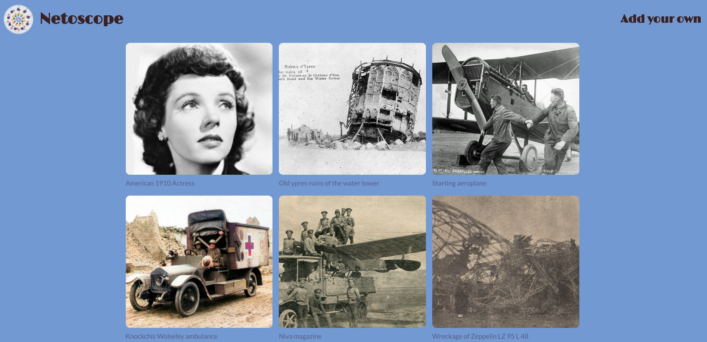

# Netoscope

## Overview

## Status -  Working version ready

Netoscope is a image board where the user is able to upload an image
and comment on existing images.

The name was inspired by
[stereoscopy](https://en.wikipedia.org/wiki/Stereoscopy) as the page
aims to be a internet version of a
[Kaiser Panorama](https://en.wikipedia.org/wiki/Stereoscopy). If you
want to see a Kaiser Panorama in person, check it out at the
[Berlin Global Exposition](https://en.wikipedia.org/wiki/Stereoscopy)
in Humbolt Forum.

## Notes

-   Current content is from the Wikipedia Commons.
-   BasicAuth is set-up to prevent thousands of uploads to my S3
    bucket.

## Tried it yourself locally

**Requirements**: git, node, npm, postgreSQL

1. Clone the repo
2. Set-up your secrets.json file based on the
   [provided example](https://github.com/Tinux-18/Netoscope/blob/main/secrets_example.json)
3. Set-up your database with `createdb <database_name>`
4. Create the tables from
   [images.sql](https://github.com/Tinux-18/Netoscope/blob/main/sql/images.sql)
5. Install npm packages with `npm i`
6. Run the app locally with `node .`

## Techstack

### Front-end

### Back-end

&nbsp;&nbsp;&nbsp;

## Features

-   basicAuth
-   Upload image
-   Comment on image
-   Delete comments
-   Expand all comments
-   Infininte scroll

## Todo

-   improve image load speed
-   refactor UI with Grid
-   deploy to Heroku

## Preview

